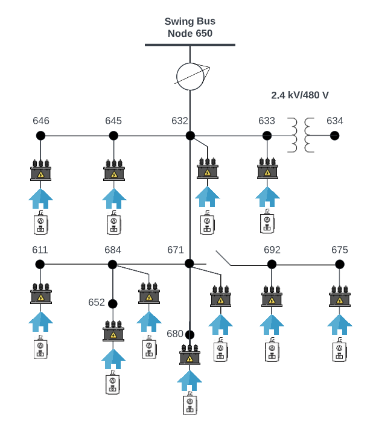

# Intro:
This repository is focused on uploading a modified version of the IEEE-13 Node Feeder to the Blazegraph. The starting point is a glm file. The glm file is converted to a dss file. Then the dss file is used in several folders
to upload it to the Blazegraph. This repo reports the progress on uploading the PSU feeder to the Blazegraph.

# Original GLM File:

The original glm file contains ~1000 triplex loads. Each load reads from a CSV file. The CSV files contain a loadshape (power consumption profiles) in 15 minutes time interval.

# Folders Contents:

* ## **CIMHub Folder:**

    - The [CIMHub](https://github.com/MidrarAdham/gld_dss_cim_conversion.git) Folder is edited by the author of his repo. The CIMHub folder now contains the converted glm file in a dss format, named Master.dss. The Master file contains several load elements (equivalent to triplex loads) that are assigned a zero kW. The load elements in Master.dss do not read power consumption values from external CSV files. 

    - **Results:** The performance comparison between the glm and dss files are not good. I don't know why.

- ## **gld_dss_conversion Folder:**
    - This folder contains the conversion trials from GridLAB-D (glm) to OpenDSS. Several version of the glm files can be found there. Each version is optimized to reduce overloads, topology changes, or change solver methods to either NR or FBS. The trial_6 contains the last settled on file. 

- ## **gridappsd_starter_kit Folder:**

    - This folder contains files that allows interaction between Python and [GridAPPS-D](https://github.com/GRIDAPPSD/gridappsd-docker.git) API. No progress has been made to this repo just yet.

 - ## **psu_feeder Folder:**

    - This folder all scripts related to the OpenDSS files and the [Modelling Environment](https://github.com/PortlandStatePowerLab/doe-egot-me.git) setup files. For now, the scripts in this folder include the ones that generate OpenDSS bus coordinates for the feeder shown in the following image, extracts UUIDs from Master.xml file, creates load elements for the Master.dss file. **This folder will need to be orgnized and rearranged, which will happen around the end of Feb 2023.**
    

  

- ## **testing_opendss Folder:**

    - This folder contains the converted glm file (Master.dss) to OpenDSS. Unlike the previous dss file, this Master.dss contains loadshape elements. These loadshape elements read kW values from external CSV files and assign the kW values to each load element. The Master.dss is configured this way just for testing. 

    - **Results:** The exported glm and dss files are assigned random kVA and kW values, respectively. As a result, the exported glm file produces a convergence error.

- ## **testing_glm Folder:**
    - This folder contains the base glm file that was used in several thesis works (created by Midrar). This glm file is now adjusted to run with both, FBS and NR solver methods.

    - **Results:** It should be noted that this file produces overload warnings in NR solver method. No warnings are produced when using FBS solver method.

- ## **references Folder:**

    - This folder contains the files that's been used as references in this work for citation purposes.
